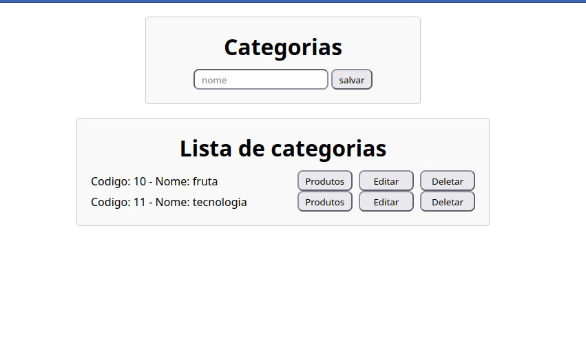
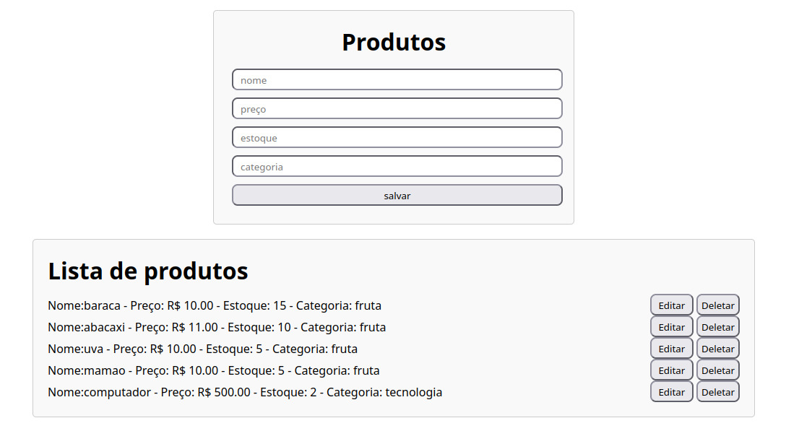

# Ecomerce python django

## Descrição

Esse é um projeto pra desafias os conhecimentos em python utilizando o frammawork Django. tratace de mini ecomerce onde o usuario consegui criar categorias e direcionar produtos para essas categorias.

## Rotas

### Categorias http://127.0.0.1:8000/categorias/

Rota para acessar as categorias, nela ira encontra input ligado a um botão salvar para criar categorias, teambem encontrara: um botão para editar as categorias que direciona para a paguina de edição, um botão para deletar uma categoria (deve ter certeza de que não existe produtos conectados a categoria antes de apaga-la) e um botão para listar os produtos ligados aquela categoria

### Produtos http://127.0.0.1:8000/produtos/

Rota para acessar os produtos, ira encontra os inputs para adicionar as caracteristicas dos produtos (nome, preço, estoque, categoria) tambem tera os mesmos botões de edição para ir a paguina de edição de produto e deletar para apagar o produto (deve verificar o id da categoria para cruiar o produto)

